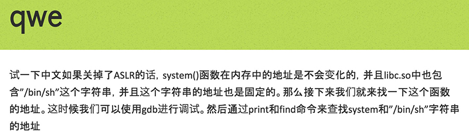
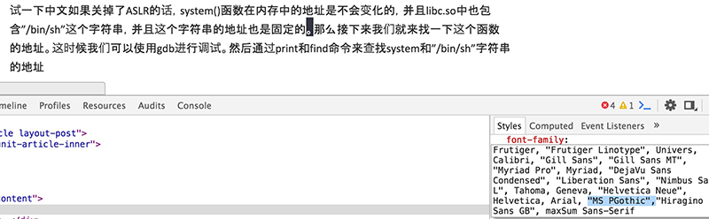
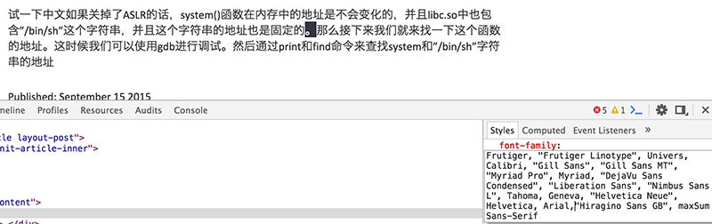
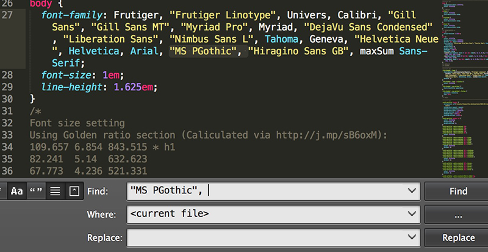



第一篇啊。。。

本来想写点这星期做了什么的

结果发觉之前说过的「字体样式不统一」的问题还没解决

作为一只弱鸡，折腾这个就折腾了大半天

不如以这个作为第一篇，来激励一下未来的自己算了。。。

初始效果如测试页



明显汉字有的大有的小有的粗有的细

应该是字体的问题

审查元素一下



逐个删掉字体，最后发觉是这个"MS Pgothic"的问题，只要把它去掉汉字立马就正常了



最终定位到

```answerrrrrrrrr.github.com/assets/themes/the-minimum/css/style.css```

把里面的所有```"MS PGothic",```字段删掉就好了



问题是解决了

不过首页懒得重写了

就这样吧。。。


